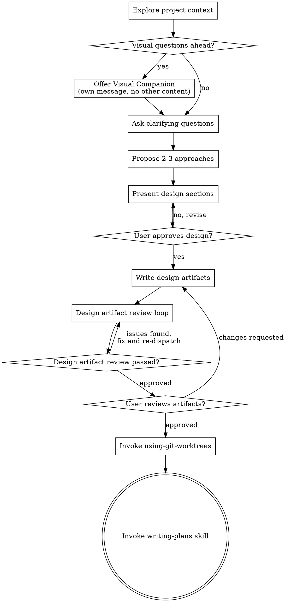

# Brainstorming Ideas Into Designs

Help turn ideas into fully formed design artifacts through natural collaborative dialogue.

Start by understanding the current project context, then ask questions one at a time to refine the idea. Once you understand what you're building, present the design. If the user already asked for end-to-end execution and there are no unresolved questions, risky tradeoffs, or explicit review requests, continue on the recommended path instead of inserting a redundant "continue?" gate.

<HARD-GATE>
Do NOT invoke any implementation skill, write any code, scaffold any project, or take any implementation action until you have presented a design and either:
1. the user has approved it, or
2. the user already asked for end-to-end execution, the design is straightforward, and no unresolved clarifications, risky tradeoffs, or explicit review requests remain.
This applies to EVERY project regardless of perceived simplicity.
</HARD-GATE>

## Anti-Pattern: "This Is Too Simple To Need A Design"

Every project goes through this process. A todo list, a single-function utility, a config change — all of them. "Simple" projects are where unexamined assumptions cause the most wasted work. The design can be short (a few sentences for truly simple projects), but you MUST present it and get approval.

## Checklist

You MUST create a task for each of these items and complete them in order:

1. **Explore project context** — check files, docs, recent commits
2. **Offer visual companion** (if topic will involve visual questions) — this is its own message, not combined with a clarifying question. See the Visual Companion section below.
3. **Ask clarifying questions** — one at a time, understand purpose/constraints/success criteria; prefer numbered options when the choices are already known
4. **Propose 2-3 approaches** — with trade-offs and your recommendation
5. **Present design** — in sections scaled to their complexity; when a real review gate remains, get user approval after each section using `request_user_input` when available for enumerable choices instead of typed approval words or a prose-only numbered reply prompt
6. **Write design artifacts** — in a Superpowers-only lane, save to `docs/superpowers/specs/YYYY-MM-DD-<topic>-design.md` and commit; in an OpenSpec-governed lane, update the relevant OpenSpec change artifacts and commit without creating a duplicate Superpowers spec file
7. **Design artifact review loop** — dispatch spec-document-reviewer subagent with precisely crafted review context (never your session history); review the written design artifacts, fix issues, and re-dispatch until approved (max 3 iterations, then surface to human)
8. **User reviews written design artifacts** — only when a real review gate remains; otherwise note the artifact paths and continue automatically
9. **Transition to isolated implementation workspace** — invoke `using-git-worktrees` before planning when implementation follows, unless already inside the dedicated worktree that should be reused
10. **Transition to implementation** — invoke writing-plans skill to create implementation plan

## Process Flow



**The terminal implementation handoff is invoking `using-git-worktrees`, then `writing-plans`.** Do NOT invoke frontend-design, mcp-builder, or any other implementation skill here.

## The Process

**Understanding the idea:**

- Check out the current project state first (files, docs, recent commits)
- Before asking detailed questions, assess scope: if the request describes multiple independent subsystems (e.g., "build a platform with chat, file storage, billing, and analytics"), flag this immediately. Don't spend questions refining details of a project that needs to be decomposed first.
- If the project is too large for a single spec, help the user decompose into sub-projects: what are the independent pieces, how do they relate, what order should they be built? Then brainstorm the first sub-project through the normal design flow. Each sub-project gets its own spec → plan → implementation cycle.
- For appropriately-scoped projects, ask questions one at a time to refine the idea
- Prefer numbered options when asking clarifying questions with known choices
- Only one question per message - if a topic needs more exploration, break it into multiple questions
- Focus on understanding: purpose, constraints, success criteria

**Exploring approaches:**

- Propose 2-3 different approaches with trade-offs
- Present options conversationally with your recommendation and reasoning
- Lead with your recommended option and explain why

## Presenting the design:

- Once you believe you understand what you're building, present the design
- Scale each section to its complexity: a few sentences if straightforward, up to 200-300 words if nuanced
- Before ending a design checkpoint, classify the checkpoint as `auto-continue`, `needs-user-decision`, or `terminal-choice`
- `auto-continue`: the next safe design or artifact step is already implied; take it now
- `needs-user-decision`: a real review or tradeoff decision remains; use `request_user_input`
- `terminal-choice`: the requested brainstorming work is genuinely complete, but do not end directly; use `request_user_input` with:
  1. 结束
  2. 继续
  3. 自由输入
- When brainstorming reaches `terminal-choice`, the next action is the popup itself. The very next action must be `request_user_input`.
- Do not produce a plain final-answer-style closeout before the terminal-choice popup, including endings framed like `当前我建议的定稿`, `就按这条落地`, or `最终建议一句话版`.
- A settled recommendation, final draft, current recommendation, or final summary is still not permission to end directly.
- Do not call `task_complete` from brainstorming while the terminal-choice popup is still pending.
- Ask after each section whether it looks right so far, using numbered approvals instead of requiring typed approval words
- When `request_user_input` is available and the approval choices are enumerable, use it instead of asking for a prose-only `reply 1/2/3` response.
- Keep a final free-text path only for new feedback that does not fit the listed approval choices.
- If the user already asked for end-to-end execution and the design is straightforward, present a concise design checkpoint and continue without waiting for a separate continue prompt.
- Stop and ask for approval only when there are material tradeoffs, unresolved risk, or the user explicitly wants to review the design before implementation.
- If the only remaining real choice is continue vs stop, ask that through `request_user_input`; otherwise ask the more specific review or next-artifact choice instead of collapsing it into a generic continue/stop prompt.
- Do not end a design checkpoint with prose-only follow-up text like `if you agree`, `if this direction looks good`, or `I can implement this next if you want`.
- Do not stop with a declarative prose-only next-step proposal like `the next best step is X`, `next I would do X`, or `I can directly prepare X next`.
- This also includes judgment-framed, comparative, or recommendation-framed next-step proposals, including Chinese variants such as `如果按我的判断，下一步应该先……`, `下一步最值得做的不是 A，而是 B`, `接下来更值得做的是……`, or `我建议先……`
- A non-terminal checkpoint must never end with `task_complete` after only a summary, recommendation, judgment, comparison, or suggestion about the next artifact step
- Either continue automatically into the next workflow step or use `request_user_input` for a real review gate.
- Do not end with prose-only next-step invitations like `if you want, I can turn this into a field-by-field table next`.
- If you can already name the next safe artifact step concretely, take it instead of narrating it and stopping.
- If the next artifact choices are enumerable, use `request_user_input` instead of a prose-only optional next-step invitation.
- Cover: architecture, components, data flow, error handling, testing
- Be ready to go back and clarify if something doesn't make sense

For approval gates, prefer patterns like:

```text
1. Agree and continue
2. Request changes
3. Input other feedback or requirements
```

Avoid requiring the user to type approval words like "agree", "approved", or "go ahead".
Do not accept a prose-only `reply 1/2/3` prompt for these enumerable approval gates when `request_user_input` is available.

**Design for isolation and clarity:**

- Break the system into smaller units that each have one clear purpose, communicate through well-defined interfaces, and can be understood and tested independently
- For each unit, you should be able to answer: what does it do, how do you use it, and what does it depend on?
- Can someone understand what a unit does without reading its internals? Can you change the internals without breaking consumers? If not, the boundaries need work.
- Smaller, well-bounded units are also easier for you to work with - you reason better about code you can hold in context at once, and your edits are more reliable when files are focused. When a file grows large, that's often a signal that it's doing too much.

**Working in existing codebases:**

- Explore the current structure before proposing changes. Follow existing patterns.
- Where existing code has problems that affect the work (e.g., a file that's grown too large, unclear boundaries, tangled responsibilities), include targeted improvements as part of the design - the way a good developer improves code they're working in.
- Don't propose unrelated refactoring. Stay focused on what serves the current goal.

## After the Design

**Documentation:**

- In a **Superpowers-only lane**, write the validated design artifact to `docs/superpowers/specs/YYYY-MM-DD-<topic>-design.md`
  - (User preferences for spec location override this default)
- In an **OpenSpec-governed lane**, update the relevant OpenSpec change artifacts instead of creating a duplicate Superpowers spec document
  - In that lane, OpenSpec artifacts are the canonical record for scope, design, and requirements
  - Do NOT maintain a parallel `docs/superpowers/specs/...` file covering the same change
- Use elements-of-style:writing-clearly-and-concisely skill if available
- Commit the resulting design artifact(s) to git

**Design Artifact Review Loop:**
After writing the design artifact(s):

1. Dispatch spec-document-reviewer subagent (see spec-document-reviewer-prompt.md)
   - In a **Superpowers-only lane**, provide the path to the written design artifact
   - In an **OpenSpec-governed lane**, provide the relevant OpenSpec artifact paths
   - If a reviewer subagent would materially help and the session consent state is unknown, use `request_user_input` to ask once before dispatching it
   - If the state is `granted`, dispatch the reviewer subagent
   - If the state is `denied`, review inline and do not ask again in the same session
2. If Issues Found: fix, re-dispatch, repeat until Approved
3. If loop exceeds 3 iterations, surface to human for guidance

## User Review Gate:
After the design artifact review loop passes, ask the user to review the written design artifacts before proceeding only when a real review gate is still needed:

> "Design artifacts written and committed to `<path-or-paths>`. Choose the next step:
> 1. Agree and continue
> 2. Request changes
> 3. Input other feedback or requirements"

When `request_user_input` is available and the next steps are enumerable, use it for this review gate instead of a prose-only numbered reply prompt.

When the original request already authorizes end-to-end execution and the artifacts match the settled design with no open issues, do not stop just to ask whether to continue. Mention the artifact paths in a progress update and proceed directly to writing-plans.
If you do open this review gate, wait for the user's response. If they request changes, make them and re-run the design artifact review loop. Only proceed once the user approves.
Do not switch back to prose-only follow-up text like `if you agree` after a tool-backed approval or review choice in the same non-terminal flow.

**Implementation:**

- Invoke `using-git-worktrees` before `writing-plans` whenever the workflow is moving from approved design into implementation work
- If implementation follows, invoke `using-git-worktrees` first to set up an isolated workspace
- If you are already inside the dedicated worktree that should carry the implementation, reuse it instead of creating a nested worktree
- After worktree setup or reuse, invoke the writing-plans skill to create a detailed implementation plan
- Do NOT invoke any other implementation skill here. The next sequence is `using-git-worktrees` → `writing-plans`

## Key Principles

- **One question at a time** - Don't overwhelm with multiple questions
- **Numbered choices preferred** - Easier to answer than open-ended when concrete choices are known
- **YAGNI ruthlessly** - Remove unnecessary features from all designs
- **Explore alternatives** - Always propose 2-3 approaches before settling
- **Incremental validation** - Present design, get approval before moving on
- **Be flexible** - Go back and clarify when something doesn't make sense

## Visual Companion

A browser-based companion for showing mockups, diagrams, and visual options during brainstorming. Available as a tool — not a mode. Accepting the companion means it's available for questions that benefit from visual treatment; it does NOT mean every question goes through the browser.

**Offering the companion:** When you anticipate that upcoming questions will involve visual content (mockups, layouts, diagrams), offer it once for consent:
> "Some of what we're working on might be easier to explain if I can show it to you in a web browser. I can put together mockups, diagrams, comparisons, and other visuals as we go. This feature is still new and can be token-intensive. Want to try it? (Requires opening a local URL)"

**This offer MUST be its own interaction.** Do not combine it with clarifying questions, context summaries, or any other content.
When `request_user_input` is available, use it for the visual companion consent question instead of a prose-only yes/no prompt.
If you must fall back to plain text, the message should contain ONLY the offer above and nothing else. Wait for the user's response before continuing. If they decline, proceed with text-only brainstorming.

**Per-question decision:** Even after the user accepts, decide FOR EACH QUESTION whether to use the browser or the terminal. The test: **would the user understand this better by seeing it than reading it?**

- **Use the browser** for content that IS visual — mockups, wireframes, layout comparisons, architecture diagrams, side-by-side visual designs
- **Use the terminal** for content that is text — requirements questions, conceptual choices, tradeoff lists, A/B/C/D text options, scope decisions

A question about a UI topic is not automatically a visual question. "What does personality mean in this context?" is a conceptual question — use the terminal. "Which wizard layout works better?" is a visual question — use the browser.

If they agree to the companion, read the detailed guide before proceeding:
`skills/brainstorming/visual-companion.md`
