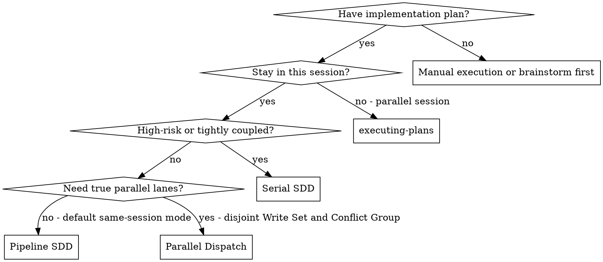
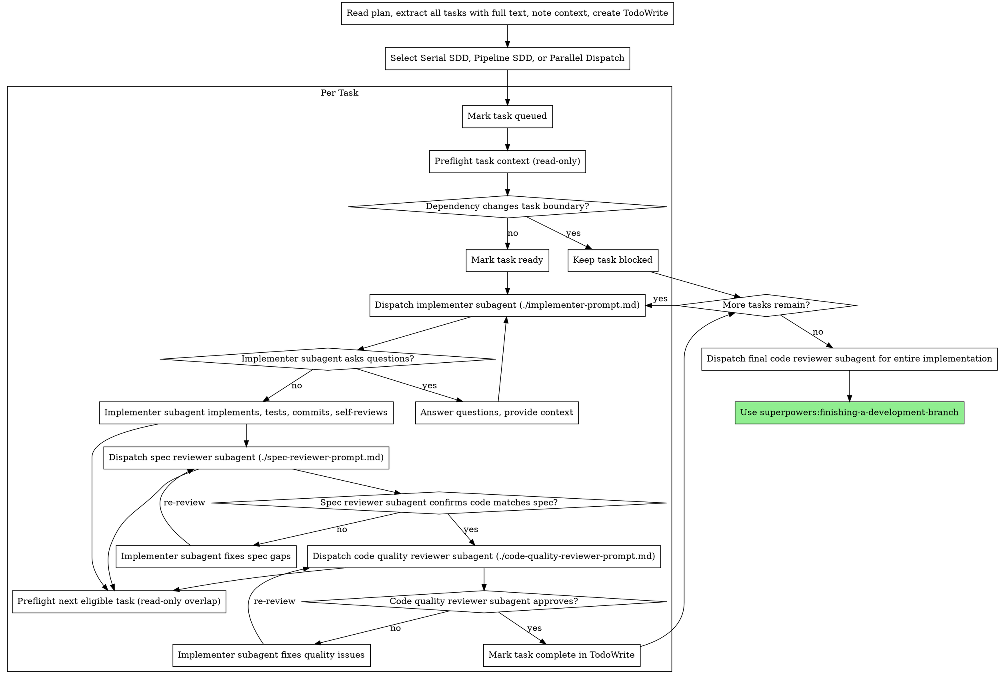

# Subagent-Driven Development

Execute plan by dispatching fresh subagent per task, with two-stage review after each: spec compliance review first, then code quality review.

**Why subagents:** You delegate tasks to specialized agents with isolated context. By precisely crafting their instructions and context, you ensure they stay focused and succeed at their task. They should never inherit your session's context or history — you construct exactly what they need. This also preserves your own context for coordination work.

**Core principle:** Fresh subagent per task + two-stage review (spec then quality) = high quality, fast iteration

**Continuous execution:** Do not pause to check in with your human partner between tasks. Execute all tasks from the plan without stopping. The only reasons to stop are: BLOCKED status you cannot resolve, ambiguity that genuinely prevents progress, or all tasks complete. "Should I continue?" prompts and progress summaries waste their time — they asked you to execute the plan, so execute it.

## When to Use



**vs. Executing Plans (parallel session):**
- Same session (no context switch)
- Fresh subagent per task (no context pollution)
- Two-stage review after each task: spec compliance first, then code quality
- Faster iteration (no human-in-loop between tasks)

## The Process

Before dispatching implementation subagents, ensure you are already inside a dedicated worktree.
If not already in a dedicated worktree, invoke `using-git-worktrees` first.
Do not create a nested worktree if one is already active; reuse the current dedicated worktree.

Treat same-session execution as three related modes:
- **Serial SDD** for high-risk or tightly coupled work
- **Pipeline SDD** as the default same-session execution mode
- **Parallel Dispatch** only when the plan proves disjoint `Write Set` and `Conflict Group` boundaries

Within **Pipeline SDD**, task states are:
`queued` → `preflight` → `ready` → `implementing` → `spec_review` → `quality_review` → `done`
and `blocked` for work that cannot safely advance yet.

`Depends on` only gates `ready` / `implementing`.
`preflight` may start early only when unresolved dependencies do not change file scope, requirement meaning, or acceptance.
If an unresolved dependency would change those task boundaries, keep the task `blocked`.

Pipeline SDD requires both:
- `implementer + preflight`
- `reviewer + preflight`

Routing priority is:
`Risk Level` > dependency changes task boundary > `Conflict Group` / `Write Set` > `Parallelizable`

Never allow multiple implementation subagents to write within the same `Conflict Group`.
Allow only read-only overlap unless the plan explicitly qualifies for **Parallel Dispatch**.

Task reviews are internal quality gates, not human approval gates. After a task passes review, move directly to the next task. Task summaries are progress updates, not requests for permission to continue. Do not stop after a reviewed task summary if more tasks remain.
Before ending a reviewed task boundary, classify the reviewed task boundary as `auto-continue`, `needs-user-decision`, or `terminal-choice`.
- `auto-continue`: the next reviewed task is already clear and safe; move to it immediately
- `needs-user-decision`: the workflow cannot safely continue until the user chooses among concrete options; use `request_user_input`
- `terminal-choice`: the requested execution work is complete, but do not end directly; use `request_user_input`
- In Codex tool-backed terminal-choice popups, author only:
  1. 结束 (Recommended)
  2. 继续
- Treat free-form requirements as the client-provided `Other` / notes path instead of authoring a duplicate free-form option
- When this reviewed-task boundary reaches `terminal-choice`, the next action is the popup itself. The very next action must be `request_user_input`.
- Do not produce a plain final-answer-style closeout before the terminal-choice popup.
- A settled recommendation, final draft, or final summary is still not permission to end directly.
- Do not call `task_complete` while the terminal-choice popup is still pending.
Do not end a reviewed task update with prose-only follow-up text like `if you want me to continue`.
Do not end a reviewed task update with a declarative prose-only next-task proposal like `the next task is for me to implement X` or `the next best step is task 3`.
This also includes judgment-framed, comparative, or recommendation-framed reviewed-task endings, including Chinese variants such as `如果按我的判断，下一步应该先……`, `下一步最值得做的不是 A，而是 B`, `接下来更值得做的是……`, or `我建议先……`
If the next reviewed task is already clear and safe, move to it instead of narrating it and stopping.
Either move directly to the next task or use `request_user_input` when a real user decision remains.
If the only remaining real decision is continue vs stop, ask that through `request_user_input`; otherwise ask the more specific next-task choice instead of collapsing it into a generic continue/stop prompt.



## Model Selection

Use the least powerful model that can handle each role to conserve cost and increase speed.

**Mechanical implementation tasks** (isolated functions, clear specs, 1-2 files): use a fast, cheap model. Most implementation tasks are mechanical when the plan is well-specified.

**Integration and judgment tasks** (multi-file coordination, pattern matching, debugging): use a standard model.

**Architecture, design, and review tasks**: use the most capable available model.

**Task complexity signals:**
- Touches 1-2 files with a complete spec → cheap model
- Touches multiple files with integration concerns → standard model
- Requires design judgment or broad codebase understanding → most capable model

## Handling Implementer Status

Implementer subagents report one of four statuses. Handle each appropriately:

**DONE:** Proceed to spec compliance review.

**DONE_WITH_CONCERNS:** The implementer completed the work but flagged doubts. Read the concerns before proceeding. If the concerns are about correctness or scope, address them before review. If they're observations (e.g., "this file is getting large"), note them and proceed to review.

**NEEDS_CONTEXT:** The implementer needs information that wasn't provided. Provide the missing context and re-dispatch.

**BLOCKED:** The implementer cannot complete the task. Assess the blocker:
1. If it's a context problem, provide more context and re-dispatch with the same model
2. If the task requires more reasoning, re-dispatch with a more capable model
3. If the task is too large, break it into smaller pieces
4. If the plan itself is wrong, escalate to the human

**Never** ignore an escalation or force the same model to retry without changes. If the implementer said it's stuck, something needs to change.

## Prompt Templates

- `./implementer-prompt.md` - Dispatch implementer subagent
- `./spec-reviewer-prompt.md` - Dispatch spec compliance reviewer subagent
- `./code-quality-reviewer-prompt.md` - Dispatch code quality reviewer subagent

## Example Workflow

```
You: I'm using Subagent-Driven Development to execute this plan.

[Read plan file once: docs/superpowers/plans/feature-plan.md]
[Extract all 5 tasks with full text and context]
[Create TodoWrite with all tasks]

Task 1: Hook installation script

[Get Task 1 text and context (already extracted)]
[Dispatch implementation subagent with full task text + context]

Implementer: "Before I begin - should the hook be installed at user or system level?"

You: "User level (~/.config/superpowers/hooks/)"

Implementer: "Got it. Implementing now..."
[Later] Implementer:
  - Implemented install-hook command
  - Added tests, 5/5 passing
  - Self-review: Found I missed --force flag, added it
  - Committed

[Dispatch spec compliance reviewer]
Spec reviewer: ✅ Spec compliant - all requirements met, nothing extra

[Get git SHAs, dispatch code quality reviewer]
Code reviewer: Strengths: Good test coverage, clean. Issues: None. Approved.

[Mark Task 1 complete]

Task 2: Recovery modes

[Get Task 2 text and context (already extracted)]
[Dispatch implementation subagent with full task text + context]

Implementer: [No questions, proceeds]
Implementer:
  - Added verify/repair modes
  - 8/8 tests passing
  - Self-review: All good
  - Committed

[Dispatch spec compliance reviewer]
Spec reviewer: ❌ Issues:
  - Missing: Progress reporting (spec says "report every 100 items")
  - Extra: Added --json flag (not requested)

[Implementer fixes issues]
Implementer: Removed --json flag, added progress reporting

[Spec reviewer reviews again]
Spec reviewer: ✅ Spec compliant now

[Dispatch code quality reviewer]
Code reviewer: Strengths: Solid. Issues (Important): Magic number (100)

[Implementer fixes]
Implementer: Extracted PROGRESS_INTERVAL constant

[Code reviewer reviews again]
Code reviewer: ✅ Approved

[Mark Task 2 complete]

...

[After all tasks]
[Dispatch final code-reviewer]
Final reviewer: All requirements met, ready to merge

Done!
```

## Advantages

**vs. Manual execution:**
- Subagents follow TDD naturally
- Fresh context per task (no confusion)
- Parallel-safe (subagents don't interfere)
- Subagent can ask questions (before AND during work)

**vs. Executing Plans:**
- Same session (no handoff)
- Continuous progress (no waiting)
- Review checkpoints automatic

**Efficiency gains:**
- No file reading overhead (controller provides full text)
- Controller curates exactly what context is needed
- Subagent gets complete information upfront
- Questions surfaced before work begins (not after)

**Quality gates:**
- Self-review catches issues before handoff
- Two-stage review: spec compliance, then code quality
- Review loops ensure fixes actually work
- Spec compliance prevents over/under-building
- Code quality ensures implementation is well-built
- Finishing flow provides the standard worktree convergence path after implementation completes

**Cost:**
- More subagent invocations (implementer + 2 reviewers per task)
- Controller does more prep work (extracting all tasks upfront)
- Review loops add iterations
- But catches issues early (cheaper than debugging later)

## Red Flags

**Never:**
- Start implementation on main/master branch without explicit user consent
- Skip reviews (spec compliance OR code quality)
- Proceed with unfixed issues
- Dispatch multiple implementation subagents that write inside the same `Conflict Group`
- Make subagent read plan file (provide full text instead)
- Skip scene-setting context (subagent needs to understand where task fits)
- Ignore subagent questions (answer before letting them proceed)
- Accept "close enough" on spec compliance (spec reviewer found issues = not done)
- Skip review loops (reviewer found issues = implementer fixes = review again)
- Let implementer self-review replace actual review (both are needed)
- **Start code quality review before spec compliance is ✅** (wrong order)
- Move to next task while either review has open issues

**If subagent asks questions:**
- Answer clearly and completely
- Provide additional context if needed
- Don't rush them into implementation

**If reviewer finds issues:**
- Implementer (same subagent) fixes them
- Reviewer reviews again
- Repeat until approved
- Don't skip the re-review

**If subagent fails task:**
- Dispatch fix subagent with specific instructions
- Don't try to fix manually (context pollution)

## Integration

**Required workflow skills:**
- **superpowers:using-git-worktrees** - Ensures isolated workspace (creates one or verifies existing)
- **superpowers:writing-plans** - Creates the plan this skill executes
- **superpowers:requesting-code-review** - Code review template for reviewer subagents
- **superpowers:finishing-a-development-branch** - Complete development after all tasks

**Subagents should use:**
- **superpowers:test-driven-development** - Subagents follow TDD for each task

**Alternative workflow:**
- **superpowers:executing-plans** - Use for parallel session instead of same-session execution

## Terminal Endgate Protocol

If this skill reaches a terminal boundary where the current request appears complete:
- This skill must not end the conversation directly with prose, `task_complete`, or a typed free-form prompt.
- Conditional approvals such as `如果没问题就继续下一阶段`, `如果设计合理就开始实现`, or `if this is sound, continue to phase 2` count as prior authorization. A positive judgment must auto-continue instead of ending with a conclusion block.
- Route true completion through `terminal-choice`.
- The very next action must be `request_user_input`.
- In Codex tool-backed terminal-choice popups, author only:
  1. 结束 (Recommended)
  2. 继续
- Treat free-form requirements as the client-provided `Other` / notes path instead of authoring a duplicate free-form option.
- Do not produce a plain final-answer-style closeout or any other prose-only closeout before the terminal-choice popup.
- If the next safe step is already implied, auto-continue instead of asking the user to type a free-form continuation or ending message.
