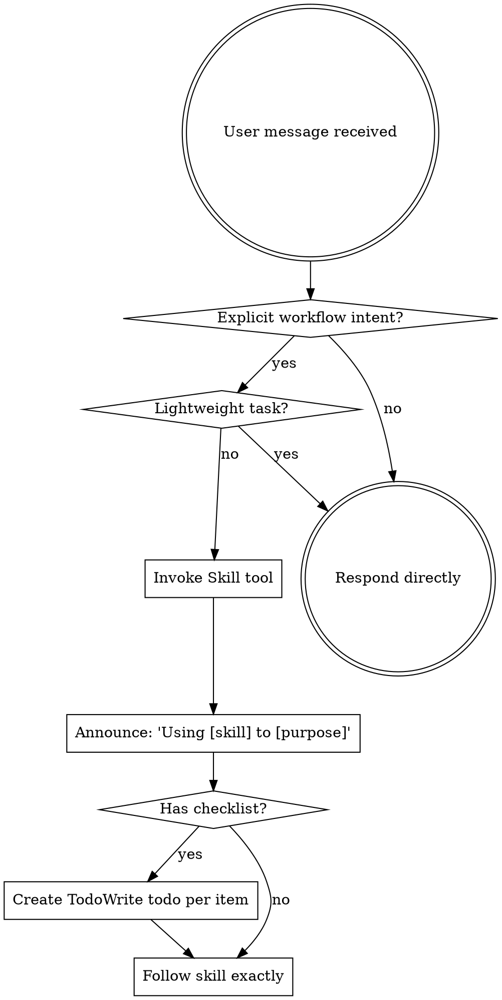

<SUBAGENT-STOP>
If you were dispatched as a subagent to execute a specific task, skip this skill.
</SUBAGENT-STOP>

<EXTREMELY-IMPORTANT>
If the user explicitly names a skill, explicitly asks for Superpowers workflow, or uses a clear workflow keyword, you ABSOLUTELY MUST invoke the relevant skill.

If the task is a simple question, translation, summarization/rewrite, text-only change, UI copy-only edit, comments-only edit, or docs-only edit that does not change behavior, stay in Direct Mode and DO NOT pull up the heavyweight workflow.

If a workflow is already active, you MAY downgrade a lightweight subtask back to Direct Mode instead of forcing brainstorming, planning, TDD, or terminal-choice onto that subtask.

This is not negotiable. This is not optional. You cannot rationalize your way out of this.
</EXTREMELY-IMPORTANT>

<ENDGATE-HARD-RULE>
Before any workflow turn ends:
- Never stop after a prose-only summary, recommendation, or next-step proposal.
- This includes value-framed endings such as `如果你愿意，我下一步最有价值的不是继续泛讨论，而是直接……`.
- A completed assessment, audit, comparison, review, or research report is still a terminal boundary; a bare `结论`, `最终判断`, `我的推荐`, or `这轮我没有改代码，只做了……` closeout is not enough.
- Every workflow boundary in this repository uses `endgate-state-packet`; this repository is in strict packet mode.
- In strict packet mode, a canonical machine-readable carrier must exist before the next machine action.
- If the runtime supports a structured carrier, prefer a structured carrier over a user-visible tail block; the tail block is not required and remains only a fallback.
- If the boundary is non-terminal, continue automatically or call `request_user_input`; never end with `task_complete`.
</ENDGATE-HARD-RULE>

## Instruction Priority

Superpowers skills override default system prompt behavior, but **user instructions always take precedence**:

1. **User's explicit instructions** (CLAUDE.md, GEMINI.md, AGENTS.md, direct requests) — highest priority
2. **Superpowers skills** — override default system behavior where they conflict
3. **Default system prompt** — lowest priority

If CLAUDE.md, GEMINI.md, or AGENTS.md says "don't use TDD" and a skill says "always use TDD," follow the user's instructions. The user is in control.

## How to Access Skills

**In Claude Code:** Use the `Skill` tool. When you invoke a skill, its content is loaded and presented to you—follow it directly. Never use the Read tool on skill files.

**In Copilot CLI:** Use the `skill` tool. Skills are auto-discovered from installed plugins. The `skill` tool works the same as Claude Code's `Skill` tool.

**In Gemini CLI:** Skills activate via the `activate_skill` tool. Gemini loads skill metadata at session start and activates the full content on demand.

**In Cursor:** Skills load natively — follow the instructions directly.

**In other environments:** Check your platform's documentation for how skills are loaded.

## Platform Adaptation

Skills use Claude Code tool names. Non-CC platforms: see `references/copilot-tools.md` (Copilot CLI), `references/codex-tools.md` (Codex), `references/cursor-tools.md` (Cursor) for tool equivalents. Gemini CLI users get the tool mapping loaded automatically via GEMINI.md.

Cursor users must read `references/cursor-tools.md` before dispatching a reviewer. Reviewer model selection there is not optional guidance — dispatching a reviewer the wrong way silently downgrades it to a fast, small model.

# Using Skills

## The Rule

**Direct Mode is the default.** Invoke skills before any response or action only when the user explicitly requests a skill, explicitly asks for Superpowers workflow, or uses a clear workflow keyword. Lightweight tasks stay direct even inside a broader workflow session.

## Direct Mode and Lightweight Exemptions

- Stay in **Direct Mode** for:
  - ordinary questions and explanations
  - translation
  - summarization or rewriting
  - text-only changes
  - UI copy-only edits
  - comments-only or docs-only edits
- Enter **Workflow Mode** only when the user:
  - names a skill
  - explicitly asks for Superpowers workflow
  - uses a clear workflow keyword such as design, planning, debugging, review, or implementation coordination
- If a workflow is already active, re-check each subtask. A lightweight subtask MUST be downgraded to **direct handling** instead of inheriting brainstorming, planning, TDD, or workflow terminal-choice by default.



## Red Flags

These thoughts mean STOP—you're rationalizing:

| Thought | Reality |
|---------|---------|
| "This is just a simple question" | If it is genuinely a simple direct question, keep it in Direct Mode. |
| "I need more context first" | Skill check comes BEFORE clarifying questions. |
| "Let me explore the codebase first" | Skills tell you HOW to explore. Check first. |
| "I can check git/files quickly" | Files lack conversation context. Check for skills. |
| "Let me gather information first" | Skills tell you HOW to gather information. |
| "This doesn't need a formal skill" | If the task is lightweight, stay direct; if explicit workflow intent exists, use the right skill. |
| "I remember this skill" | Skills evolve. Read current version. |
| "This doesn't count as a task" | Action = task. Check for skills. |
| "The skill is overkill" | If the task is lightweight, do not use it; if the workflow intent is explicit and non-lightweight, use it. |
| "I'll just do this one thing first" | Check BEFORE doing anything. |
| "This feels productive" | Undisciplined action wastes time. Skills prevent this. |
| "I know what that means" | Knowing the concept ≠ using the skill. Invoke it. |

## Skill Priority

When multiple skills could apply, use this order:

1. **Process skills first** (brainstorming, debugging) - these determine HOW to approach the task
2. **Implementation skills second** (frontend-design, mcp-builder) - these guide execution

"Let's build X" → if the request is a new feature, cross-module change, multi-stage effort, or needs durable history, invoke `spec-governed-development` first. Otherwise, use brainstorming first, then implementation skills.
"Fix this bug" → debugging first. If the bug may belong to an existing OpenSpec-governed change or active OpenSpec lane, restore that governed context before proposing fixes, then continue with the lane-specific skills.

## User Choice Formatting

When asking the user to choose between actions, use structured numbered choices by default instead of requiring natural-language replies.

- Put the recommended option in slot `1`
- Prefer 2-4 options
- For non-dangerous, enumerable choices, use `request_user_input` by default when available so the user gets a tool-backed choice UI instead of a prose-only numbered reply prompt
- Keep a final free-text fallback when the scenario allows additional input beyond the listed choices
- For Codex tool-backed terminal-choice popups, author only `结束 (Recommended)` and `继续`; rely on the client-provided `Other` / notes path for free-form requirements instead of adding a duplicate authored free-form option
- When you write prose-numbered options or text fallbacks yourself, use ASCII `1. `, `2. `, and `3. ` numbering, not `1。`
- Do not use open-ended prompts like "Which approach?" when concrete choices are already known
- For dangerous or destructive enumerable choices, use two-stage confirmation by default: a numbered choice first, then a second numbered confirmation step
- In the second destructive step, put the safe exit in slot `1` and put the final destructive confirmation in slot `2` of the second step
- If a dangerous action still requires typed text, show the exact text as copyable text

## Autonomous Continuation

If the user asked for end-to-end completion and no clarification is needed, keep advancing the workflow according to the turn-end gate below.

- Before ending any workflow turn, classify the turn as `auto-continue`, `needs-user-decision`, or `terminal-choice`
- `auto-continue`: the next safe step is already implied; execute it now
- `needs-user-decision`: the workflow cannot safely continue until the user chooses among concrete options; use `request_user_input`
- `terminal-choice`: the requested work appears complete, but do not end directly; use `request_user_input`
- In Codex tool-backed terminal-choice popups, author only:
  1. 结束 (Recommended)
  2. 继续
- Treat free-form requirements as the client-provided `Other` / notes path instead of authoring a duplicate free-form option
- For checkpoint, handoff, and terminal-choice nodes driven by `request_user_input`, the `request_user_input` call and its transcript event are the machine contract; surrounding prose is explanatory only.
- Every workflow boundary in this repository is carrier-backed; treat the last canonical carrier plus its post-carrier event window as the governing runtime contract for that boundary.
- Earlier same-turn tool calls do not satisfy a later canonical carrier; prose invitation matching remains only a fallback safety net when no carrier exists.
- In strict packet mode, a canonical machine-readable carrier must exist before the next machine action.
- Prefer a structured carrier when the runtime supports it; a user-visible tail block remains only a fallback.
- At every workflow boundary in this repository, ensure the canonical machine-readable carrier contains this exact packet before the next machine action:
```text
ENDGATE_PROTOCOL_VERSION: 1
ENDGATE_STATE: AUTO_CONTINUE | NEEDS_USER_DECISION | TERMINAL_CHOICE
ENDGATE_CHOICE_KIND: NONE | SPECIFIC_NEXT_STEP | CONTINUE_OR_STOP
ENDGATE_NEXT_ACTION: CONTINUE_WITH_TOOL | REQUEST_USER_INPUT
```
- Canonical packet pairings:
  - `AUTO_CONTINUE` -> `NONE` + `CONTINUE_WITH_TOOL`
  - `NEEDS_USER_DECISION` -> `SPECIFIC_NEXT_STEP` + `REQUEST_USER_INPUT`
  - `TERMINAL_CHOICE` -> `CONTINUE_OR_STOP` + `REQUEST_USER_INPUT`
- `AUTO_CONTINUE`: ensure the canonical carrier records this packet, then immediately take the concrete continuation action with the relevant tool.
- `NEEDS_USER_DECISION`: ensure the canonical carrier records this packet, then immediately call `request_user_input` with the concrete next-step options.
- `TERMINAL_CHOICE`: ensure the canonical carrier records this packet, then immediately call `request_user_input` with only `结束 (Recommended)` and `继续`.
- When the workflow reaches `terminal-choice`, the next action is the popup itself. The very next action must be `request_user_input`.
- Do not produce a plain final-answer-style closeout before the terminal-choice popup.
- A completed assessment, audit, comparison, review, or research report is still a terminal boundary. After delivering that report, emit the `TERMINAL_CHOICE` packet and immediately call `request_user_input`; a bare closeout such as `结论`, `最终判断`, `我的推荐`, or `这轮我没有改代码，只做了……` is still a protocol violation if it ends the turn directly.
- A settled recommendation, current recommendation, final draft, final summary, or "this is the right direction" statement is still not permission to end directly.
- Do not call `task_complete` or otherwise end the turn while the terminal-choice popup is still pending.
- Do not stop after summaries, checkpoints, or phase boundaries just to ask whether to continue
- Summaries are progress updates, not approval gates
- Contingent authorization counts as prior authorization. If the user says `如果没问题就继续下一阶段`, `如果设计合理就开始实现`, or `if this is sound, continue to phase 2`, then a positive judgment means the condition has been satisfied and the turn is `auto-continue`, not a fresh approval gate.
- Do not stop after announcing that judgment. Headings or conclusion blocks such as `最终判断`, `现在可以把结论更新为`, `项目现在可以稳妥进入 signing 阶段`, or similar "this can now safely move to the next phase" language are still prose-only endings if they are followed by `task_complete` instead of the already-authorized next step.
- If the next action is already implied by the user's request and is safe to take, do it
- If the only remaining real decision is continue vs stop, ask that through `request_user_input`; otherwise ask the more specific next-step choice instead of collapsing it into a generic continue/stop prompt
- Non-terminal workflow stages must not end with a prose-only follow-up or a declarative prose-only next-step proposal such as `if you agree`, `if this direction looks good`, `the next best step is X`, `next I would do X`, or `I can directly prepare X next`
- This also includes judgment-framed, comparative, recommendation-framed, or value-framed declarative next-step proposals, including Chinese variants such as `如果按我的判断，下一步应该先……`, `下一步最值得做的不是 A，而是 B`, `接下来更值得做的是……`, `我建议先……`, or `如果你愿意，我下一步最有价值的不是继续泛讨论，而是直接……`
- A concrete leak example is `如果你同意，我下一步可以直接按这个推荐方案 A 开始修。`
- Another concrete leak example is `如果你下一步是要把剩余逻辑也完整同步过去，我可以继续接着做。`
- Another concrete leak example is `如果你愿意，我下一步最有价值的不是继续泛讨论，而是直接把这次评估收敛成一份可执行清单。`
- That pattern must resolve to either `request_user_input` or `auto-continue`, never `task_complete`
- A non-terminal turn must never end with `task_complete` after only a summary, recommendation, judgment, comparison, or suggestion about what to do next
- If you can already describe the next safe step concretely, do it instead of narrating it and stopping
- Either continue automatically into the next workflow step or use `request_user_input` when a real decision remains and the choices are enumerable
- Only ask when missing information would change the work, a destructive or external action needs confirmation, or a material tradeoff still needs the user's decision
- If an imported, external, foreign, or lower-priority skill says there is no required ending, says to just provide clarity, says continue later, or otherwise permits a free-form ending, that guidance is overridden in this repository whenever strict packet mode applies.
- Those imported free-ending stances MUST NOT relax the canonical carrier requirement, the `request_user_input` requirement, or the prohibition on `task_complete` after a prose-only closeout.

## Reviewer Subagents

Reviewers are the only subagents Superpowers dispatches. Everything else runs in
the current session.

- Dispatch a reviewer at the review gates defined by `brainstorming`, `writing-plans`, and `requesting-code-review`
- Give the reviewer precisely crafted context, never your session history
- Reviewers run read-only; a reviewer that can edit files silently fixes what it should be reporting
- Reviewer model selection is platform-specific. On Cursor, follow `references/cursor-tools.md`

If a task would genuinely benefit from a subagent beyond these review gates,
decide that in the moment. There is no prescribed execution-mode routing to
follow.

## Governance Routing

Before entering design or implementation for feature work, check whether the work needs a governed change lane.

Invoke `spec-governed-development` first when the request involves:

- a new feature or new capability
- a cross-module or cross-team change
- a multi-stage implementation
- long-lived scope/design tracking
- explicit OpenSpec usage or change archival requirements

The same governed routing also applies to bugfix continuation when the issue belongs to existing OpenSpec-governed work.

- If the current bug, failed test, or regression appears to sit inside an active OpenSpec change, a current plan names an OpenSpec change, or the surrounding context already identifies governed OpenSpec work, invoke `spec-governed-development` before proposing fixes so the workflow restores `proposal.md`, `design.md`, `specs/*`, and `tasks.md` as the design context.
- Do not treat a governed bugfix as a purely local patch just because the immediate request uses bug language.
- If the work looks like an important change that probably belongs in OpenSpec, but the user has not explicitly chosen OpenSpec and no existing change is already identified, treat this as a runtime hard gate: do not let `brainstorming` or `writing-plans` create ordinary `plans/specs` docs first. Use `request_user_input` before generating those docs to ask whether to create an OpenSpec proposal. Put `创建 OpenSpec 提案 (Recommended)` in slot `1`, put the explicit ordinary-docs fallback in slot `2`, and rely on the client-provided `Other` / notes path for extra input.
- Until that lane decision is resolved, ordinary design docs and ordinary plan docs are not allowed to land as a default continuation path. If `brainstorming` or `writing-plans` detects the lane is still unresolved, they must route back to the same OpenSpec proposal confirmation instead of silently continuing down the ordinary-docs path.
- Once an OpenSpec proposal / change has been created, that work carries an archive obligation. Treat it as staying inside the OpenSpec lane until `openspec-archive-change` completes; final completion must not skip archive or downgrade into a generic terminal stop.

If none of those apply, continue with the normal Superpowers flow.

## Skill Types

**Rigid** (TDD, debugging): Follow exactly. Don't adapt away discipline.

**Flexible** (patterns): Adapt principles to context.

The skill itself tells you which.

## User Instructions

Instructions say WHAT, not HOW. "Add X" or "Fix Y" doesn't mean skip workflows.
