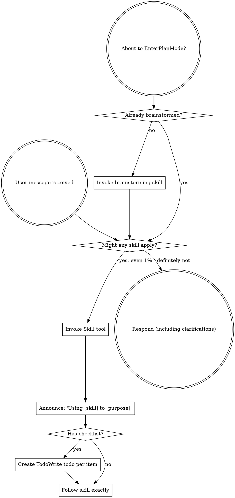

<SUBAGENT-STOP>
If you were dispatched as a subagent to execute a specific task, skip this skill.
</SUBAGENT-STOP>

<EXTREMELY-IMPORTANT>
If you think there is even a 1% chance a skill might apply to what you are doing, you ABSOLUTELY MUST invoke the skill.

IF A SKILL APPLIES TO YOUR TASK, YOU DO NOT HAVE A CHOICE. YOU MUST USE IT.

This is not negotiable. This is not optional. You cannot rationalize your way out of this.
</EXTREMELY-IMPORTANT>

## Instruction Priority

Superpowers skills override default system prompt behavior, but **user instructions always take precedence**:

1. **User's explicit instructions** (CLAUDE.md, GEMINI.md, AGENTS.md, direct requests) — highest priority
2. **Superpowers skills** — override default system behavior where they conflict
3. **Default system prompt** — lowest priority

If CLAUDE.md, GEMINI.md, or AGENTS.md says "don't use TDD" and a skill says "always use TDD," follow the user's instructions. The user is in control.

## How to Access Skills

**In Claude Code:** Use the `Skill` tool. When you invoke a skill, its content is loaded and presented to you—follow it directly. Never use the Read tool on skill files.

**In Copilot CLI:** Use the `skill` tool. Skills are auto-discovered from installed plugins. The `skill` tool works the same as Claude Code's `Skill` tool.

**In Gemini CLI:** Skills activate via the `activate_skill` tool. Gemini loads skill metadata at session start and activates the full content on demand.

**In other environments:** Check your platform's documentation for how skills are loaded.

## Platform Adaptation

Skills use Claude Code tool names. Non-CC platforms: see `references/copilot-tools.md` (Copilot CLI), `references/codex-tools.md` (Codex) for tool equivalents. Gemini CLI users get the tool mapping loaded automatically via GEMINI.md.

# Using Skills

## The Rule

**Invoke relevant or requested skills BEFORE any response or action.** Even a 1% chance a skill might apply means that you should invoke the skill to check. If an invoked skill turns out to be wrong for the situation, you don't need to use it.

## Red Flags

These thoughts mean STOP—you're rationalizing:

| Thought | Reality |
|---------|---------|
| "This is just a simple question" | Questions are tasks. Check for skills. |
| "I need more context first" | Skill check comes BEFORE clarifying questions. |
| "Let me explore the codebase first" | Skills tell you HOW to explore. Check first. |
| "I can check git/files quickly" | Files lack conversation context. Check for skills. |
| "Let me gather information first" | Skills tell you HOW to gather information. |
| "This doesn't need a formal skill" | If a skill exists, use it. |
| "I remember this skill" | Skills evolve. Read current version. |
| "This doesn't count as a task" | Action = task. Check for skills. |
| "The skill is overkill" | Simple things become complex. Use it. |
| "I'll just do this one thing first" | Check BEFORE doing anything. |
| "This feels productive" | Undisciplined action wastes time. Skills prevent this. |
| "I know what that means" | Knowing the concept ≠ using the skill. Invoke it. |

## Skill Priority

When multiple skills could apply, use this order:

1. **Process skills first** (brainstorming, debugging) - these determine HOW to approach the task
2. **Implementation skills second** (frontend-design, mcp-builder) - these guide execution

"Let's build X" → if the request is a new feature, cross-module change, multi-stage effort, or needs durable history, invoke `spec-governed-development` first. Otherwise, use brainstorming first, then implementation skills.
"Fix this bug" → debugging first, then domain-specific skills.

## User Choice Formatting

When asking the user to choose between actions, use structured numbered choices by default instead of requiring natural-language replies.

- Put the recommended option in slot `1`
- Prefer 2-4 options
- For non-dangerous, enumerable choices, use `request_user_input` by default when available so the user gets a tool-backed choice UI instead of a prose-only numbered reply prompt
- Keep a final free-text fallback when the scenario allows additional input beyond the listed choices
- When you write prose-numbered options or text fallbacks yourself, use ASCII `1. `, `2. `, and `3. ` numbering, not `1。`
- Do not use open-ended prompts like "Which approach?" when concrete choices are already known
- For dangerous or destructive enumerable choices, use two-stage confirmation by default: a numbered choice first, then a second numbered confirmation step
- In the second destructive step, put the safe exit in slot `1` and put the final destructive confirmation in slot `2` of the second step
- If a dangerous action still requires typed text, show the exact text as copyable text

## Autonomous Continuation

If the user asked for end-to-end completion and no clarification is needed, keep advancing the workflow according to the turn-end gate below.

- Before ending any workflow turn, classify the turn as `auto-continue`, `needs-user-decision`, or `terminal-choice`
- `auto-continue`: the next safe step is already implied; execute it now
- `needs-user-decision`: the workflow cannot safely continue until the user chooses among concrete options; use `request_user_input`
- `terminal-choice`: the requested work appears complete, but do not end directly; use `request_user_input` with:
  1. 结束
  2. 继续
  3. 自由输入
- Do not stop after summaries, checkpoints, or phase boundaries just to ask whether to continue
- Summaries are progress updates, not approval gates
- If the next action is already implied by the user's request and is safe to take, do it
- If the only remaining real decision is continue vs stop, ask that through `request_user_input`; otherwise ask the more specific next-step choice instead of collapsing it into a generic continue/stop prompt
- Non-terminal workflow stages must not end with a prose-only follow-up or a declarative prose-only next-step proposal such as `if you agree`, `if this direction looks good`, `the next best step is X`, `next I would do X`, or `I can directly prepare X next`
- This also includes judgment-framed, comparative, or recommendation-framed declarative next-step proposals, including Chinese variants such as `如果按我的判断，下一步应该先……`, `下一步最值得做的不是 A，而是 B`, `接下来更值得做的是……`, or `我建议先……`
- A non-terminal turn must never end with `task_complete` after only a summary, recommendation, judgment, comparison, or suggestion about what to do next
- If you can already describe the next safe step concretely, do it instead of narrating it and stopping
- Either continue automatically into the next workflow step or use `request_user_input` when a real decision remains and the choices are enumerable
- Only ask when missing information would change the work, a destructive or external action needs confirmation, or a material tradeoff still needs the user's decision

## Session-Scoped Subagent Consent

Maintain a session-scoped consent state for subagent use: `unknown`, `granted`, `denied`.

- When subagents would materially help and the state is unknown, use `request_user_input` to ask once whether subagents may be used in this session
- Do not silently downgrade before asking
- Do not downgrade first and explain later
- After granted or denied, reuse that state for the rest of the session
- If the state is `granted`, use subagents when they help without re-asking
- If the state is `denied`, do not ask again unless the user explicitly reopens the decision or higher-priority instructions require a different path

## Governance Routing

Before entering design or implementation for feature work, check whether the work needs a governed change lane.

Invoke `spec-governed-development` first when the request involves:

- a new feature or new capability
- a cross-module or cross-team change
- a multi-stage implementation
- long-lived scope/design tracking
- explicit OpenSpec usage or change archival requirements

If none of those apply, continue with the normal Superpowers flow.

## Skill Types

**Rigid** (TDD, debugging): Follow exactly. Don't adapt away discipline.

**Flexible** (patterns): Adapt principles to context.

The skill itself tells you which.

## User Instructions

Instructions say WHAT, not HOW. "Add X" or "Fix Y" doesn't mean skip workflows.
